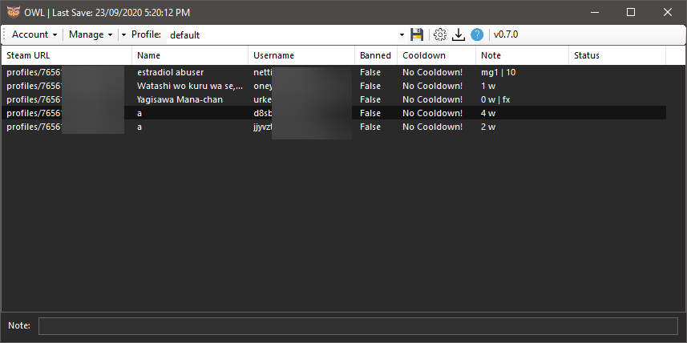

#  OWL
A multipurpose tool for managing Steam accounts
<table>
    <tr><td><b>State</b></td><td>Beta</td></tr>
    <tr><td><b>Latest Release</b></td><td>0.7.0</td></tr>
    <tr><td><b>License</b></td><td>MIT</td></tr>
</table>



## Requirements
* <a href="https://dotnet.microsoft.com/download/dotnet-framework">.NET Framework</a> (4.5 or <b>Higher</b>)

## Features
* Multiple Loadable Profiles for different set of accounts. ✓
* Auto-Login ✓
* Cooldown Tracker ✓
* Protection of information (Encryption/Obfuscation + Hashing)
* Import accounts from <a href="https://github.com/Ashesh3/Steam-Account-Generator">Steam Account Generator</a> ✓
* Import accounts from  <a href="https://accgen.cathook.club">Cathook's Account Generator</a>'s Local Storage (Firefox ✓)
* Steam User Data Management ✓
* Steam Account Editor
* Steam Hour Booster

## Shortcut Keys
<table>
    <tr><td><b>Save Profile</b></td><td>Ctrl + S</td></tr>
    <tr><td><b>Remove Account</b></td><td>Delete</td></tr>
    <tr><td><b>Add 21 Hour Cooldown</b></td><td>Ctrl + D</td></tr>
    <tr><td><b>Login</b></td><td>Ctrl + F</td></tr>
    <tr><td><b>Add New Account</b></td><td>Ctrl + N</td></tr>
    <tr><td><b>Edit Account</b></td><td>Ctrl + E</td></tr>
    <tr><td><b>Clipboard (All Info)</b></td><td>Ctrl + C</td></tr>
    <tr><td><b>Obtain Info</b></td><td>Ctrl + A</td></tr>
    <tr><td><b>Open URL</b></td><td>Ctrl + O</td></tr>
</table>

* Setting up the login method for the shortcut key <i>Ctrl + F</i> is available in the settings form.

## Configuring OWL
You can configure OWL through the settings form or manually through the <i>config.json</i> file located at the base of OWL.
<b>Warning: Do not manually modify the hashedKey Value</b>

```json
{
    "steamPath":"C:/Program Files (x86)/Steam",
    "defaultProfile":"default",
    "hashedKey":"",
    "steamParam":"",
    "cooldownRefresh":800,
    "maxThreads":4,
    "loginMethod":0,
    "forceStatus":false,
    "maskPassword":true,
    "clipboardDetail":false,
    "startupUpdateChk":true
}
```

## Importing from <a href="https://github.com/Ashesh3/Steam-Account-Generator">Steam Account Creator</a>
* You can import accounts generated by SAC through SAC's <i>accounts.txt</i> account dump.
* Make sure you are atleast running SAG <b>v1.1.2-pre7</b> or higher.
* Make sure you are using the <i>"Original Formatting"</i> format. You can change this at the "File Writing" Tab
* Make sure that the <i>accounts.txt</i> dump is properly formatted.
* Make sure that "Write to file" is checked.


## Licenses / Built with / Credits
* Flat Icons + Graphics - <a href="https://www.flaticon.com/">FlatIcon</a> (Creative Commons)

## Development
### Prerequisite
* <a href="https://www.newtonsoft.com/json">Json.NET</a> Framework for handling the Json format. (<a href="https://www.nuget.org/packages/Newtonsoft.Json/">NuGet</a>)
* <a href="https://github.com/GeReV/NSoup">NSoup</a> for parsing HTML (<a href="https://www.nuget.org/packages/NSoup/">NuGet</a>)
* <a href="https://system.data.sqlite.org/index.html/doc/trunk/www/index.wiki">System.Data.SQLite</a> for parsing firefox local storage (<a href="https://www.nuget.org/packages/System.Data.SQLite/">NuGet</a>)

### Further Development
Project is mostly dead and I am no longer going to continue with this code base as I am aware that this project is badly written, horribly documented, riddled with bad coding practice and horrible implementation.

## To Do
* Local Storage import for Chrome